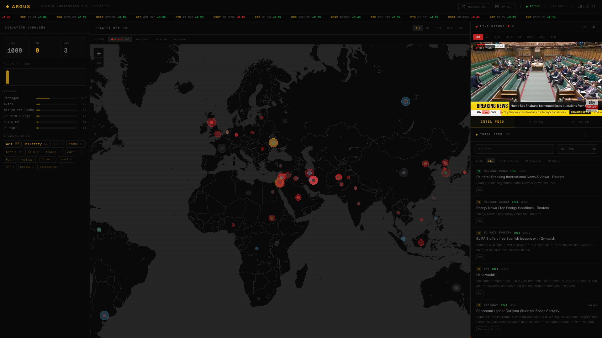
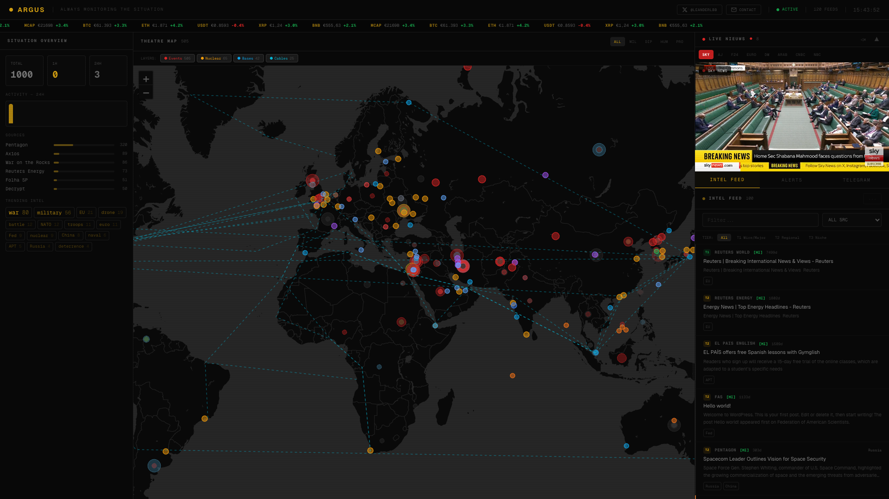

# ARGUS - Real-time global intelligence dashboard

**Live:** [argus.prototipo.nl](https://argus.prototipo.nl) · **Alerts:** [@ArgusDashboard on X](https://x.com/ArgusDashboard) · **Feed:** [/rss](https://argus.prototipo.nl/rss)

[](https://ko-fi.com/lb377260)

An event-centric OSINT monitoring dashboard focused on politics & conflict. ARGUS clusters 120+ tiered news feeds into live **situations** you can zoom into and drill down on - with an interactive conflict map, source-reliability scoring, and a calm overview that escalates only when something is actually happening. Self-hosted, no subscriptions, no editorial filter, no AI/token cost.



## What it does

- **Event-centric situations** - news is auto-clustered into live situations (Strait of Hormuz, Ukraine front, Iran-Israel...) with severity, velocity (articles/hour) and source-tier corroboration (A/B/C). New flashpoints auto-emerge into their own dossier.
- **Drill-down dossiers** - click a situation for a timeline of the latest developments, ranked by source reliability, with direct source links. The map flies to its location.
- **Interactive map (Leaflet)** - situations as severity-coloured markers, plus toggleable layers: military ADS-B flights, satellites, GDELT conflicts, carrier groups, cameras, maritime chokepoints, **HAZARD** (USGS earthquakes + GDACS disasters), **THERMAL** (NASA FIRMS thermal anomalies).
- **Global threat gauge** - one number with a clickable breaking/active dropdown that links straight to sources.
- **120+ RSS feeds, 3-tier reliability** - wire services -> regional specialists -> state media, each labelled (T1/T2/T3) so you know how much to trust it.
- **Telegram OSINT, sanctions, humanitarian, satellite and arms panels.**
- **Persistent** - survives restarts via an on-disk snapshot; self-refreshing.

## Screenshots



## Stack

Next.js 16 (App Router) - React 19 - Tailwind v4 - Leaflet (CartoDB dark) - in-memory store (no DB, on-disk snapshot for persistence). Runs on a Mac Mini via launchd, public via Cloudflare Tunnel. No external AI calls - zero token cost.

## Run it

```bash
npm install
npm run build
npm start          # serves on :3003
```

Optional map layers read free keys from `.env.local` (gitignored):

```
FIRMS_MAP_KEY=...            # NASA FIRMS thermal layer (free MAP_KEY)
```

Without this key the FIRMS thermal layer simply stays empty; everything else works.

## Data sources & attribution

NASA FIRMS, USGS, GDACS, GDELT, OpenSky, CelesTrak, CoinGecko, and 120+ public RSS feeds. Each source has its own usage/attribution terms - respect them when redeploying.

## Support

ARGUS is free and self-funded. If it is useful to you: https://ko-fi.com/lb377260

## Custom monitors

ARGUS is a template as much as a product: different feeds, different map layers, same engine. Want a custom monitoring site for your sector (shipping, energy, security)? [Get in touch](https://leanderbloot.nl/contact).

## License

AGPL-3.0 - see [LICENSE](LICENSE).

Free to use, study and modify. If you run a modified version as a public
service, the AGPL requires you to publish your source. For a commercial or
closed-source license, contact the author.

---

Built by Leander Bloot ([@LeanderLBB](https://x.com/LeanderLBB)) - powered by a Mac Mini and stubbornness.
